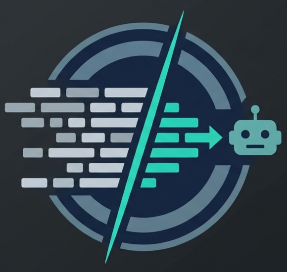

<div align="center">
  
  <h4>⚡ Token-saving response trimmer for Claude Code MCP tools.</h4>
</div>
<br/>

MCP tools often return huge JSON responses — full of fields the agent never uses.
**mcp-trim** automatically strips those away, so Claude only sees the fields that matter. Less noise, fewer tokens, faster sessions.

> **TL;DR:** Install → define which fields to keep → every matching MCP response gets trimmed automatically. Or let auto-learning figure it out for you.

---

## Table of Contents

- [How It Works](#how-it-works)
- [Use Cases](#use-cases)
- [Quick Start](#quick-start)
- [Creating Rules](#creating-rules)
- [Examples](#examples)
- [Auto-Learning](#auto-learning)
- [Token Savings](#token-savings)
- [Configuration Reference](#configuration-reference)
- [CLI Reference](#cli-reference)
- [Library API](#library-api)
- [Uninstall](#uninstall)

---

## How It Works

```
      Claude calls MCP tool
               │
               ▼
    Tool returns full response
               │
               ▼
         mcp-trim hook
               │
               ▼
        Trimmed response
               │
               ▼
   Claude sees only needed fields
```

The plugin hooks into Claude Code's `PostToolUse` event. When an MCP tool (any tool named `mcp__*`) returns a response, mcp-trim checks your rules, keeps only the fields you specified, and passes the trimmed result back to Claude.

Built-in tools (`Bash`, `Read`, `Edit`, etc.) are **never** affected.

---

## Use Cases

### Automated CI/CD pipelines

If your agent runs repeated workflows — triaging issues, reviewing PRs, checking build status — every MCP call returns the same bloated response. Trimming rules let you define once which fields matter and save tokens on every subsequent call.

### Long-running coding sessions

During extended sessions Claude may call the same MCP tools dozens of times. Without trimming, each call burns tokens on fields like permissions, URLs, and metadata the agent never reads. Over a session, that can add up to tens of thousands of wasted tokens.

### Multi-tool orchestration

When the agent coordinates across multiple MCP servers (GitHub + Jira + Slack, for example), responses compound quickly. Trimming each server's output to just the fields used keeps the context window lean and lets the agent handle longer conversations before hitting limits.

### Predictable API shapes

MCP tools that wrap REST APIs (GitHub, Jira, Linear, Notion, etc.) return stable JSON shapes. Once you know which fields the agent actually uses, a trimming rule is a one-time setup that pays off on every call — no code changes, no prompt engineering.

### Auto-learning for new tools

When you start using a new MCP server and don't yet know which fields matter, enable auto-learning and let mcp-trim observe a few sessions. After enough feedback, it suggests rules automatically — no manual field analysis required.

---

## Quick Start

### Option A: Claude Code Plugin (Recommended)

```bash
/plugin marketplace add pask00/mcp-trim
/plugin install mcp-trim@mcp-trim
```

Hooks and the `field-usage-feedback` skill are set up automatically. Just create your first rule:

```bash
mcp-trim init
mcp-trim set github-repos \
  --tool "mcp__github__get_repository" \
  --keep "id,name,full_name,html_url,description"
```

### Option B: npm (Manual Setup)

```bash
# 1. Install
npm install -g mcp-trim

# 2. Register the hooks with Claude Code
mcp-trim install            # local project
mcp-trim install --global   # all projects

# 3. Create your first rule
mcp-trim init
mcp-trim set github-repos \
  --tool "mcp__github__get_repository" \
  --keep "id,name,full_name,html_url,description"
```

That's it — every matching MCP response is now trimmed automatically.

---

## Creating Rules

### Simple: comma-separated fields

```bash
mcp-trim set github-repos \
  --tool "mcp__github__get_repository" \
  --keep "id,name,full_name,html_url,description"
```

### Nested: JSON shape

Use `--keep-json` when you need to filter nested objects:

```bash
mcp-trim set github-repos \
  --tool "mcp__github__get_repository" \
  --keep-json '{"id":true,"name":true,"owner":{"login":true}}'
```

### Regex: match multiple tools

The `--tool` pattern supports regex, so you can match a whole MCP server:

```bash
mcp-trim set github-all \
  --tool "mcp__github__.*" \
  --keep "id,name,title,state"
```

### Agent self-configuration

Claude Code can create rules on the fly via Bash — useful when the agent encounters a verbose response and wants to trim it for future calls:

```bash
mcp-trim set jira-issues --tool "mcp__jira__list_issues" --keep "key,summary,status,assignee"
```

---

## Examples

The [`examples/`](./examples) folder contains ready-to-use configs for common MCP servers. Each example has its own directory with a `config.json` and a `README.md` explaining the scenario.

| Example | Description |
|---------|-------------|
| [`minimal/`](./examples/minimal) | Bare-bones single-rule starting point |
| [`auto-learn-only/`](./examples/auto-learn-only) | No rules — relies entirely on auto-learning |

Copy one to your project and customize:

```bash
# Start from an example
cp examples/minimal/config.json .config/mcp-trim/config.json
```

---

## Auto-Learning

Don't want to write rules by hand? Auto-learning watches how tools are used and generates rules for you.

### How it works

1. **Track** — Every MCP response is profiled automatically (field names, sizes, frequency).
2. **Feedback** — The agent reports which fields it actually used (via the `field-usage-feedback` skill or `mcp-trim feedback`).
3. **Suggest** — After enough data (`minInvocations` + `minFeedback`), mcp-trim proposes rules that keep only the fields the agent needs.
4. **Apply** — Auto-created rules are **session-scoped** by default. Use `--apply` to promote them to your global config.

### Recording feedback

```bash
mcp-trim feedback --session <session-id> \
  --tool "mcp__github__get_repository" \
  --used "id,name,description,owner.login"
```

### Viewing & applying suggestions

```bash
# See what mcp-trim recommends
mcp-trim suggest --session <session-id>

# Apply suggestions to config.json (available to all future sessions)
mcp-trim suggest --session <session-id> --apply
```

Example output:
```
Suggested Rules (1):

  auto-mcp__github__get_repository
    Based on: mcp__github__get_repository (12 invocations)
    Confidence: 100%
    Est. savings: ~65% (~1,200 chars/call)
    Keep: id, name, full_name, html_url, forks_count
    Keep.owner: login
```

### Fully automatic mode

Enabled by default. When a tool has enough observations **and** feedback, a rule is auto-created in the **session file** (`sessions/<session_id>.json`) — it only applies to that session. Your global `config.json` is never modified automatically.

To promote auto-learned rules so they apply to **all** sessions, use:

```bash
mcp-trim suggest --session <session-id> --apply
```

This writes the suggested rules into `config.json`, making them permanent and globally available.

To disable auto-learning entirely:

```json
{ "autoLearn": { "enabled": false } }
```

> **Important:** Feedback is required for suggestions. Without at least `minFeedback` (default: 3) feedback entries for a tool, no rule will be suggested or auto-created.

---

## Token Savings

### Example savings

With a typical GitHub repository response:

| | Characters | Tokens (est.) |
|---|---|---|
| **Original response** | ~2,500 | ~625 |
| **After trimming** (5 fields) | ~250 | ~63 |
| **Savings** | **90%** | **~562 tokens** |

Multiply across dozens of API calls per session and the savings are substantial.

### Checking your stats

```bash
mcp-trim stats --session <id>
```

```
Token Savings Statistics

  Total invocations:     142
  Total original chars:  285,000
  Total trimmed chars:   42,000
  Total saved chars:     243,000
  Est. tokens saved:     ~60,750
  Overall savings:       85%

Per-Tool Profiles:

  mcp__github__get_repository
    Invocations: 45 | Saved: 180,000 chars (89%) | Rule: github-repos
    Fields tracked: 22
```

Reset with `mcp-trim stats --session <id> --reset`.

> Token estimates use a 4:1 character-to-token ratio. Actual savings vary by tokenizer.

---

## Configuration Reference

Rules live in `.config/mcp-trim/config.json` (searched from CWD upward, then home directory).

### Example config

```json
{
  "version": 1,
  "rules": [
    {
      "id": "github-repos",
      "description": "Trim GitHub MCP repo responses",
      "match": { "toolName": "mcp__github__get_repository" },
      "keep": {
        "id": true,
        "name": true,
        "full_name": true,
        "owner": { "login": true, "id": true }
      }
    }
  ],
  "autoLearn": { "enabled": true, "minInvocations": 5, "minFeedback": 3 },
  "debug": false
}
```

> `mcp-trim init` creates an example rule with `enabled: false`. Use `mcp-trim set` to create your own.

### Rule fields

| Field | Description |
|-------|-------------|
| `id` | Unique rule identifier |
| `description` | Human-readable description |
| `match.toolName` | Regex matched against the MCP tool name (case-insensitive). Falls back to exact match if the regex is invalid. |
| `keep` | JSON shape of fields to preserve. `true` = keep field and all children. `{ ... }` = keep and filter children recursively. Omit to pass the full response through. |
| `enabled` | Set to `false` to disable without deleting |

**Matching behavior:** `toolName` is required. If multiple rules match, only the **first** match applies. All matching is case-insensitive.

### Settings

| Setting | Default | Description |
|---------|---------|-------------|
| `autoLearn.enabled` | `true` | Enable auto-learning and auto-rule creation |
| `autoLearn.minInvocations` | `5` | Minimum observations before auto-creating a rule |
| `autoLearn.minFeedback` | `3` | Minimum feedback entries per tool before suggesting |
| `debug` | `false` | Log tool calls to `logs.jsonl` |

### Files created

All files live inside `.config/mcp-trim/` (alongside the nearest `config.json`):

| File | Description |
|------|-------------|
| `config.json` | Trimming rules and settings |
| `logs.jsonl` | Tool call log (when `debug: true`) |
| `sessions/<session_id>.json` | Per-session auto-learned rules and stats |

---

## CLI Reference

### Commands

```bash
mcp-trim init                            # Create default config
mcp-trim reset                           # Reset config to defaults
mcp-trim install [--global]              # Register hooks with Claude Code
mcp-trim uninstall [--global]            # Remove hooks from Claude Code
```

### Rule management

```bash
mcp-trim list                            # Show all rules
mcp-trim show <id>                       # Show a rule as JSON
mcp-trim set <id> [options]              # Add or update a rule
mcp-trim remove <id>                     # Delete a rule
mcp-trim test <id> --input <file>        # Dry-run on sample JSON
```

**`set` options:**

| Option | Description |
|--------|-------------|
| `--tool <pattern>` | MCP tool name regex |
| `--keep <fields>` | Comma-separated top-level fields |
| `--keep-json <json>` | Full keep shape as JSON |
| `--description <text>` | Rule description |
| `--disable` / `--enable` | Toggle rule on/off |

### Stats & suggestions

```bash
mcp-trim stats --session <id>            # Show token savings
mcp-trim stats --session <id> --reset    # Reset stats
mcp-trim suggest --session <id>          # Show suggested rules
mcp-trim suggest --session <id> --apply  # Auto-apply suggestions
```

### Feedback

```bash
mcp-trim feedback [options]              # Record which fields the agent used
```

| Option | Description |
|--------|-------------|
| `--session <id>` | Session ID (required) |
| `--tool <name>` | Tool name |
| `--used <fields>` | Comma-separated field paths, optional counts via colon (e.g., `"id:3,name,owner.login:2"`) |
| `--used-json <json>` | Field paths as JSON array or `{field: count}` object |
| `--feedbacks <n>` | Number of feedback entries to record (default: 1) |
| `--batch <json>` | Batch multiple tools: `'[{"tool":"...","used":{"f1":3},"feedbacks":3}]'` |

### Logs

```bash
mcp-trim logs                            # Show logged tool calls
mcp-trim logs --clear                    # Clear the log
mcp-trim logs --last <n>                 # Show last n entries
mcp-trim logs --json                     # Output as JSON array
```

---

## Library API

Use the trimming engine programmatically in TypeScript/JavaScript:

```typescript
import {
  filterFields, extractJson, replaceJsonInText,
  loadConfig, findMatchingRules, buildFilterOptions,
  upsertRule, removeRule, suggestRules,
  loadSessionData, saveSessionData,
} from 'mcp-trim';

// Filter JSON directly
const trimmed = filterFields(myData, {
  keep: { id: true, name: true, owner: { login: true } },
});

// Extract JSON from mixed text
const matches = extractJson(mcpResponse);

// Use the config pipeline
const config = loadConfig();
const rules = findMatchingRules('mcp__github__get_repository', config);
```

<details>
<summary>Full list of exports</summary>

```typescript
import {
  // Core filtering
  filterFields, extractJson, replaceJsonInText,
  // Config management
  loadConfig, saveConfig, findConfigPath, findConfigDir, getDefaultConfig,
  findMatchingRules, buildFilterOptions, upsertRule, removeRule,
  // Stats & feedback
  resetStats, recordInvocation, recordFeedback,
  // Suggestions
  suggestRules, suggestionToRule,
  // Field analysis
  collectFieldPaths, totalJsonSize, topLevelFields, groupNestedFields,
  // Tool call logging
  logToolCall, readToolCallLogs, clearToolCallLogs, findLogsPath,
  // Session management
  loadSessionRules, saveSessionRules, upsertSessionRule,
  loadSessionStats, saveSessionStats,
  loadSessionData, saveSessionData, resolveSessionPath,
  // Hook utilities
  normalizeInput, runSessionStartHook,
  // Utility
  readStdin, parseFieldCounts,
} from 'mcp-trim';
```

</details>

---

## Uninstall

**Claude Code plugin:**

```bash
/plugin uninstall mcp-trim@mcp-trim
/plugin marketplace remove mcp-trim
```

**npm:**

```bash
mcp-trim uninstall                  # Remove hooks
rm -rf .config/mcp-trim             # Remove config, stats, and logs
npm uninstall -g mcp-trim
```

---

## License

MIT
